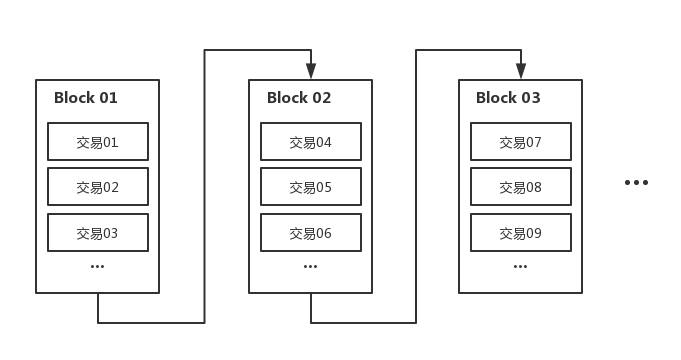
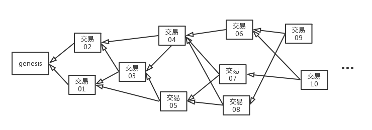
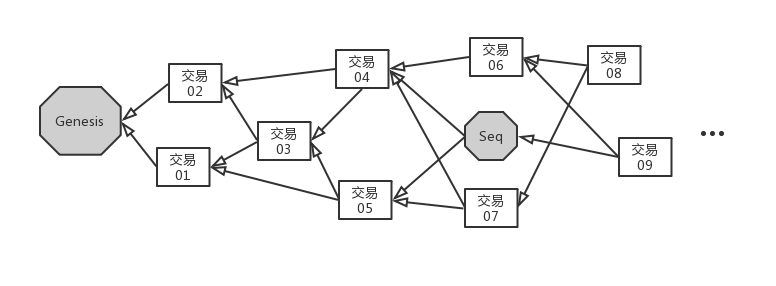
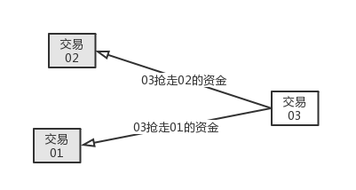

# 第二届众安黑客松大赛区块链赛道

## 背景知识
本次开发大赛将全程基于 AnnChain 的开源区块链项目 OG 进行开发。选手需要了解 OG 的基本结构以及交易在 OG 上的确认方式，从而能够对策略的制定提供帮助。
#### DAG 结构的账本
在传统区块链结构中，交易信息被定期地打包进一个区块，区块之间以链式结构连接，如下图：

该区块中包含了所有确认的交易的Hash值、内容。

与之相对的，Dag (Directed acyclic graph) 有向无环图结构的账本则是将区块中的交易打散，使交易与交易之间直接相连。通过交易来确认交易，保障交易哈希的不可篡改性。

可以在图上看到，一笔交易在广播出去的时候，需要选择1-2笔网络中已经存在的交易进行跟随，发送交易本身也是对前置交易的一种确认。

**父交易：** 某交易主动跟随的交易。如图：交易03的父交易为[交易02，交易01]。
**祖先交易：** 所有能够通过跟随箭头追溯到的交易。如图：交易07的祖先交易为[genesis，交易01，交易02，交易03，交易04，交易05]

如果我们采用传统的”打包交易、定时出块“的方式，则区块链的性能会被出块时间和网络带宽制约，无论如何会有一个性能天花板（最大可能TPS=max(区块大小)/min(出块间隔)）。

以DAG形式组织的分布式账本，其交易在平时就已经被广播到全网了，没有打包区块的概念。由于交易能够直接确认交易，也没有出块间隔的困扰。典型的DAG结构分布式账本如IOTA、ByteBall等，已经从实践上证明DAG拥有更大的灵活性和可扩展性，方案是可行的。

#### Annchain.OG
Annchain.OG是一个基于DAG结构的分布式账本技术。Annchain.OG在DAG结构上进行了深入的技术创新研发，首次实现了秒级的最终确认、全面的图灵完备智能合约支持以及超大规模并发交易的急速同步处理等。

#### 图结构的要求
为了防止双花，对于**同一个地址**发送的交易，在Annchain.OG的图上必须满足如下条件：
- **父交易绑定**：任何一笔交易如果需要在OG上存在，必须选择一个或两个父交易进行挂载。没有父交易的交易是无法存在于OG网络上的（除了genesis）。所有的挂载关系是交易的一部分，需要被签名后伴随交易进行全网广播。
- **Nonce递增原则**：每一笔交易都必须附上该地址的一个唯一递增序号（Nonce），以标明交易发送的顺序。不同地址的交易不受限制。

**禁止**：Nonce大小错乱，如同一人发送的Nonce为7的交易成为了Nonce为6的交易的父交易或祖先交易。
**禁止**：Nonce跳跃或重复：如同一人发送了Nonce为7的交易，之后发送了Nonce为9的交易，且Nonce为8的交易不存在，或不在7和9之间。
根据上面的规则，我们可以推导出以下规则：
**禁止**：交易分叉，如Nonce为7的交易和Nonce为8的交易不在一条路径上。

规则简而言之一句话：**同一人的所有交易必须被一条不分叉的路径唯一串联，使得每一笔交易的Nonce递增1**

#### Sequencer的作用
与传统的DAG结构略有区别的是，Annchain.OG在DAG中加入了Sequencer的概念：

Sequencer的作用在于：
- **锚定图结构，验证这部分交易的有效性，使图上的一部分交易得到最终确认。**
Sequencer作为一个“出块”概念的替代者，起到的是对于整个DAG图的锚定作用。传统的DAG结构对于交易的最终确认是无法判定的。例如IOTA基于随机游走的概率权重，导致交易的确认率非常低，大量交易被牺牲；ByteBall基于见证人确认主干，见证人的选择基于声望等主观因素，可靠性低；Conflux的主链确定算法使用GHOST规则，容易被恶意节点操纵成摇摆树，根本不可能实现最终确认。
Annchain.OG 创新性地结合了传统区块链和DAG构型，加入Sequencer，相当于对散动的DAG图上按上图钉。经过Sequencer确认的图结构不可更改的。这样只要提高Sequencer的提出速度，就能让交易得到尽可能快的**最终确认**。
- **确定这部分交易的顺序，以形成有顺序的交易序列。**
目前的DAG结构的分布式账本都不支持图灵完备的智能合约引擎（如EVM等），其原因在于DAG上的交易是无法确定顺序的，而顺序的不同会造成执行结果的大相径庭。Sequencer的加入，使得交易能够在局部被确认全序，从而能够像传统区块链一样被智能合约引擎按个处理。

#### Sequencer的产生
Sequencer定期由所有参与共识的节点通过改进的BFT共识讨论产生。普通的OG网络一般为5秒以下。
所有参与共识的节点定期通过报名、可验证随机函数选举、基于BLS的分布式密钥生成技术等进行共识换届，保证充分的全网参与度，避免中心化。

#### TxPool
TxPool是Annchain.OG处理逻辑中的重要一环，其中暂存了所有该节点收到的、经过本地验证但是没有被Sequencer最终确认的交易。产生Sequencer的节点所确认的交易全部来自于TxPool。

#### Tip
Tip池是所有在TxPool中并且没有被任何其它交易跟随的“最新尖端交易”。如果一个节点需要产生新的交易，Tip池会是新的交易的父交易的重要来源（非必须）。

##规则

Dag的图结构使得交易之间存在一种直接的连接关系。在OG中，这种连接关系保证了交易hash间的关联。那么能否利用这种关联关系来增加区块链系统的可玩性呢？

有基于此，在本次黑客松中我们对这种交易间的父子关系增加了一个特殊的效果：

**前序交易parent会被后序交易child抢走部分资金**



如图所示，如果 `Tx03` 的 parents 为 `Tx01` 和`Tx02`，则 `Tx03` 会抢走它 parents 交易`Tx01` 和 `Tx02`的部分资金。

围绕这个规则，我们重新开发了OG并制定了一整套游戏玩法：

####规则1. 争抢空投

每个Sequencer都会有一个 `treasure` 字段，表示空投的金额。如果 Seq 被普通交易tx认作parent，则此 tx 会抢走`treasure`的资金。


如果有多个 交易tx 将此 Seq 认作 parent，则所有的这些 tx 共同瓜分 `treasure` 。为了明确瓜分的比例，所有的tx必须提供一个`guarantee` 保证金字段，根据各个交易tx的保证金比例来决定瓜分的比例：


如上图，tx01的保证金是 100，tx02 的保证金是 300。所以tx01抢走 1/4 的`treasure`，也就是 250；tx02 抢走 3/4 的 `treasure` 也就是 750。

####规则2. Rob

如果普通交易tx01被其他交易认作 parent，则 tx01**从 parents 抢到的钱**和**它自己的保证金**都会以一定比例被其child 抢走。在我们的系统中，这个比例是 40%。


如上图，假设tx01已经从它的parents中抢得 1000。此后它被 tx02 和 tx03 跟随，那么tx01 抢到的钱和保证金就会被`tx02`和`tx03`瓜分掉40%。

`tx01` 抢到了 1000，保证金是 100，所以最后会被后序交易抢走 `1000*40%+100*40%=440`。由于`tx02`和`tx03`的保证金都是100，所以他们每人抢得金额为`440*(1/2)=220`。

#### 规则3. 查封和清算

- **查封：**每个Sequencer除了扮演新一轮的空投角色外，还要负责上一轮的查封和清算工作。当 Sequencer 产生时，它会将当前所有未被其他交易跟随的 tips 都认作自己的parent。所有最后被sequencer跟随的交易都会被Sequencer抢走部分资金，抢钱逻辑和**规则2**一致，但是被抢的比例为 **50%**。我们称这个过程查封。

  

  如图所示，tx01 会被seq抢走 `1000*50% + 100*50% = 550`, tx02 和 tx03 同理。

- **清算：**每一轮游戏都以一个新的seq产生做为开始，以下一个新的seq产生做为结束。只有等下一个seq产生时，本轮的所有收益或者支出才会进行结算。所有被查封的金额全都会被销毁，不会计入任何人的账户中。每一笔交易的收益计算如下公式：

  ```
  一笔tx的收益 = 从parents抢到的钱 - 被child抢走的钱
  
  以上图tx01为例子，它的最终收益就是：
  1000 - 550 = 450
  
  最后这 450 会被加入到账户的余额中。
  ```

  


#### 评判标准

每个队伍分配一个private key，内有一部分启动资金。

比赛结束时余额最多的队伍获得胜利。


## 竞赛规则
- 各参赛队伍应当在组委会的规定技术框架内进行公平竞争。不允许以任何方式入侵、攻击、滥用组委会服务器或基础设施。
- 禁止队伍间窥探、交换私钥、token和其它私密信息。
- 禁止冒用、顶替他人身份。禁止非法组队。
- 组委会有权禁止未预计的任何非正常比赛行为，有权禁止严重影响比赛平衡的漏洞利用行为。

## 开发细节-API
为了方便参赛队员在短时间内接入到区块链网络，组委会封装了所有在比赛中需要/能够使用的API，并提供了三种语言（Go、Python、Java）的SDK，使得选手可以专注于对DAG网络的理解和策略的制定上，而无需在有限的时间内关注接入细节。参赛队员并不需要在本机运行全节点或开发接入代码。

每个队伍都会被分配一个唯一的token，用于进行API的请求。该token用于限制用户进行大量恶意的攻击。
开发者只需要替换掉代码中token的内容即可，使用SDK发送http请求时token已经被处理，开发者无需关心。

详细的API接口如下（以Java为例）：
### queryNonce(String address)
返回对应账户地址的当前Nonce。在发送交易前，用户需要提供一个Nonce，以区别前后交易，避免双花。
即，如果本次交易需要使用的Nonce为6，如果这笔交易被成功验证，则下一笔交易的Nonce为7。
如果在同一个Sequencer中发送两笔交易，也需要遵守这个规则。
即使交易未被Sequencer确认，只要节点收到这笔交易（进入TxPool），queryNonce的结果会被更新为该笔交易中的Nonce值。
注意：**一个合法的交易，如果Nonce=n，则它必须有一个祖先交易（可以是非直接父交易），该祖先交易的Nonce为n-1，即单个地址发送的交易必须在图上能够被一条单一的路径串联，且Nonce呈递增关系。**
如果该交易最终被验证为非法，则Nonce会被回滚。

### sendTx(Transaction tx) 100次/分钟
向区块链网络发送一笔交易。该方法会自动处理交易的签名。
Transaction的详细内容如下：
- **parents**：根据DAG和比赛的要求，该笔交易需要选择1-2笔父交易，以形成合法的DAG结构。此处填入父交易的Hash值数组。
- **from**：自己的地址，可以通过account.Address()拿到。
- **to**：必须为null/None/nil，比赛环境不允许私下转账。
- **nonce**：该笔交易所使用的Nonce。该Nonce只能被用于一笔合法的交易上，按照交易数量递增1。
- **guarantee**：对这笔交易所下的赌注/保证金。
- **value**：必须为0。比赛环境不允许私下转账。

### queryBalance(String address)
返回对应账户地址的当前余额。

### queryTransaction(String hash)
查询指定Hash的某一笔交易

### querySequencerByHash(String hash)
查询指定Hash的某一笔Sequencer

### querySequencerByHeight(long height)
查询指定高度的某一笔Sequencer

### queryTxsByAddress(String address)
查询某一个地址的所有历史交易

### queryTxsByHeight(long height)
查询某一个高度上的所有交易

### queryAllTipsInPool() 5次/分钟
查询当前在交易池中所有没有被其它交易跟随的交易

### queryAllTxsInPool() 5次/分钟
查询当前在交易池中所有的交易

## 开发细节-MQ

为了使开发者能够快速收到整个网络的最新交易，组委会提供了Kafka消息队列设施，用于通知订阅者最新的交易事件。
消息队列会向开发者推送如下消息：
- 新的Sequencer产生：
```
{'type': 1, 'data': {'type': 1, 'hash': '0x97efc39c5f7eb8e319fff579a50afe0b69a463f80441e5635c37d073dfd3dc74', 'parents': ['0xedc86567ffaf12df14c39360a45bcf2126ca406eb2f3ea94d17ebf82e7685179'], 'from': '0x7349f7a6f622378d5fb0e2c16b9d4a3e5237c187', 'nonce': 7885, 'treasure': '1000', 'height': 7885, 'weight': 12925}}
```
- 新的（合法的但是未经确认的）Transaction产生：
```
{'type': 0, 'data': {'type': 0, 'hash': '0x6513196894db559ea4c4b673a21a96b370c66bd3ceec0abe29ea6ec34f203006', 'parents': ['0x97efc39c5f7eb8e319fff579a50afe0b69a463f80441e5635c37d073dfd3dc74'], 'from': '0xc4321fee1e29b13b042feab06dea55e7caf85948', 'to': '0x0000000000000000000000000000000000000000', 'nonce': 5040, 'guarantee': '100', 'value': '0', 'weight': 12926}}
```
通过解析该JSON字符串，我们可以获取到最新的交易，从而绑定上对应的交易发送逻辑。
一些可能的策略是：
- （收到Sequencer）-（立即发送交易，以Sequencer的Hash为parent）
- （收到Sequencer）-（等15秒）-（发送交易，以Sequencer和场上任何一个其它交易（如有）的Hash为parents）
- （收到Tx）-（发送交易，以Tx的Hash为parents）

策略的制定是灵活的，开发者可以根据比赛的进展、对手的策略等实时调整自己的发送策略。
